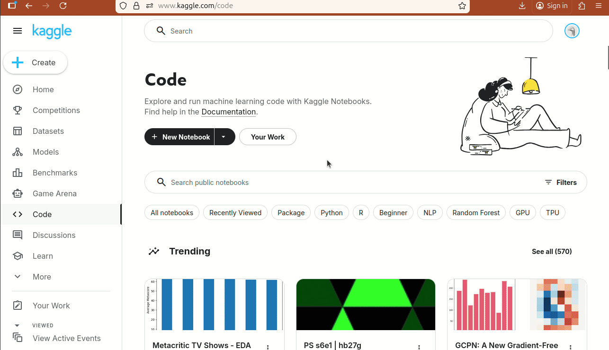
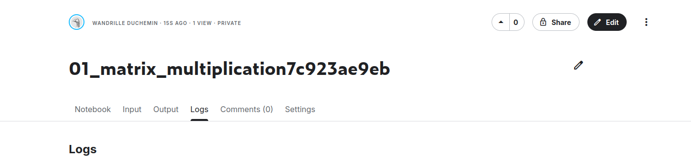

# Creating a Kaggle gpu session

The goal of this small tutorial is to showcase how to upload a notebook and run in in a sesison with a GPU in [kaggle](https://www.kaggle.com/).

Kaggle allows [free access to GPU for up to 30h/week](https://www.kaggle.com/discussions/general/108481), it is thus a resources of choice for testing a few things with GPUs.

## 1. create an account on [kaggle](https://www.kaggle.com/)

Go to [kaggle](https://www.kaggle.com/) and sign in or create an account there.

## 2. upload the notebook on kaggle

Once sogned in, from the kaggle frontpage click on **"Create"**, then **"Import Notebook"** and upload your notebook of choice.

Once the file is uploaded, kaggle is going to want to run through it. 
We do not care about this, and instead want to click on the **"Edit"** button on the top-right.

This should get you to a view of your notebook where you can edit and run the cells.

## 3. activate the GPU

Go to **Setting > Accelerator** and select your desired GPU (GPU T4x2 is mote than enough for now).

You will get prompted about the availibility, with a message reminding you how much of your 30 hours per week you have remaining. **Confirm** that you want to turn on the GPUs, and then **run a code cell** to start the GPU-enabled session.

After a few seconds you should be able to see that your session is running and has access to some GPUs.

