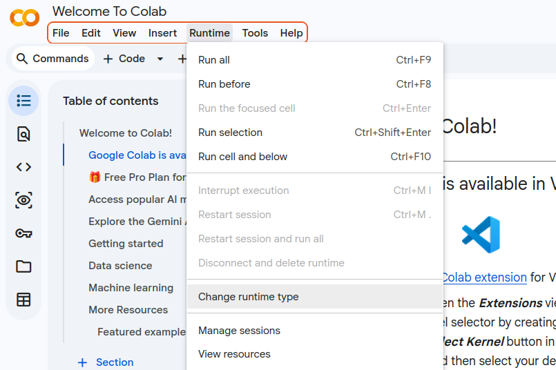
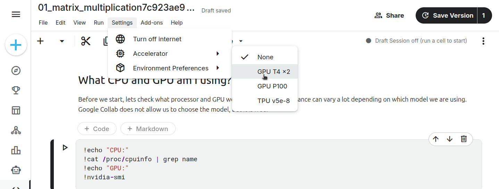

# GPU-programming: getting a GPU-enabled session

During the hands-on of this course you will need to have access to a CUDA-enable GPU on which you can run some code.
This document describes three options to achieve this each with their own pros and cons. 

1. **[google colab](https://colab.research.google.com)**: gives free access to some basic GPUs. It is very easy to setup, but the GPUs are sometimes unavailable (or only available for a limited time).
2. **[kaggle](https://www.kaggle.com/)**: grants free access to 30h/week of GPUs (which is enough to cover our needs for this course). It is less easy to setup than google colab, but the GPU access is stabler than with google colab.
3. **local installation**. This is te ideal as the code runs on your own machine, but of course for this you need to possess a CUDA-capable GPU (*i.e.*, a relatively recent Nvidia GPU) and the installation process can be a bit tricky.


## 1. Creating a Google colab gpu session

### 1.1. create an account on [google colab](https://colab.research.google.com)

To connect to [google colab](https://colab.research.google.com) you will need a google account.

### 1.2. activate the GPU 

Among the options on the top, go to **Runtime > Change Runtime type**.

{ width=350px }

In the popup that appears, select the **T4 GPU** and confirm your chice by clicking "Save".


### 1.3. check that the GPU is available

Create  new code cell in the notebook and run the following command (note the `!` at the beginning of the line):

```
!nvidia-smi
```

The output should look something like:

```
Wed Jan 28 08:14:19 2026       
+-----------------------------------------------------------------------------------+
| NVIDIA-SMI 550.54.15        Driver Version: 550.54.15      CUDA Version: 12.4     |
|-----------------------------------+------------------------+----------------------+
| GPU  Name           Persistence-M | Bus-Id          Disp.A | Volatile Uncorr. ECC |
| Fan  Temp   Perf    Pwr:Usage/Cap |           Memory-Usage | GPU-Util  Compute M. |
|                                   |                        |               MIG M. |
|===================================+========================+======================|
|   0  Tesla T4                 Off |   00000000:00:04.0 Off |                    0 |
| N/A   48C    P8        9W /   70W |       0MiB /  15360MiB |      0%      Default |
|                                   |                        |                  N/A |
+-----------------------------------+------------------------+----------------------+
                                                                                         
+-----------------------------------------------------------------------------------+
| Processes:                                                                        |
|  GPU   GI   CI        PID   Type   Process name                        GPU Memory |
|        ID   ID                                                         Usage      |
|===================================================================================|
|  No running processes found                                                       |
+-----------------------------------------------------------------------------------+
```

Where we can inspect the CUDA version (12.4 here) and confirm that we have access to a Tesla T4 GPU.

## 2. Creating a Kaggle gpu session

The goal of this small tutorial is to showcase how to upload a notebook and run a session with GPUs on [kaggle](https://www.kaggle.com/).

Kaggle allows [free access to GPU for up to 30h/week](https://www.kaggle.com/discussions/general/108481), it is thus a resource of choice for testing small things on GPUs.

### 2.1. create an account on [kaggle](https://www.kaggle.com/)

Go to [kaggle](https://www.kaggle.com/) and sign in or create an account there.

### 2.2. upload the notebook on kaggle

Once signed in, from the kaggle frontpage click on **"Create"**, then **"Import Notebook"** and upload your notebook of choice.

> For instance, you can use [this one](https://drive.google.com/uc?export=download&id=1Q5C_aKbiWjuNwQY7Vn8p-2Ezi_o-8H-8), which will be the first notebook we will go through in the course.


Once the file is uploaded, kaggle is going to want to run through it. 
We do not care about this, and instead want to click on the **"Edit"** button on the top-right.


This should get you to a view of your notebook where you can edit and run the cells.

### 2.3. activate the GPU


Go to **Setting > Accelerator** and select your desired GPU (GPU T4x2 is mote than enough for now).

In order to use GPUs, you need to verify your phone number. Otherwise, they will appear grayed out. To do so, scroll down in the right column and click in the tab "Session Options". Scroll down again and click in phone validation. After following the process, GPUs will be enabled.

You will get prompted about the availibility, with a message reminding you how much of your 30 hours per week you have remaining. **Confirm** that you want to turn on the GPUs, and then **run a code cell** to start the GPU-enabled session.

After a few seconds you should be able to see that your session is running and has access to some GPUs.



### 2.4. Close your session

Once finished, don't forget to close your session clicking on the button on the top right corner.

## 3. Local installation (Linux + Windows)

First, make sure you have a [compatible Nvidia GPU](https://developer.nvidia.com/cuda/gpus) (most fairly recent GPUs will work).

### 3.1. Driver installation

If they are not already installed, you will need to install Nvidia drivers.

**Check if you have a pre-existing installation:** in a terminal run `nvidia-smi` it the command is recognized then it means that the drivers are already installed. (NB: [on Windows you may have to look for the .exe location](https://stackoverflow.com/questions/57100015/how-do-i-run-nvidia-smi-on-windows)).

**Cuda Toolkit installation:** follow the instuctions on the [nvidia-cuda website](https://developer.nvidia.com/cuda-downloads)

You can then check the installation with the command: `nvcc --version`

### 3.2. Python installation (make sure you have Python installed first)

A relatively good "trick" to install the python packages used to interface with CUDA is to [install the pytorch library](https://pytorch.org/get-started/locally/).


We recommend using using [uv](https://docs.astral.sh/uv/getting-started/installation/), a fast Python package manager (but you can use any method that you are comfortable with, `pip` is a good alternative).

```sh
#Create a virtual environment and activate it:
uv venv .venv
source .venv/bin/activate
#Choose the right packages, see: https://pytorch.org/get-started/locally/
#For example for CUDA 13:
uv pip install torch torchvision --index-url https://download.pytorch.org/whl/cu130
```
